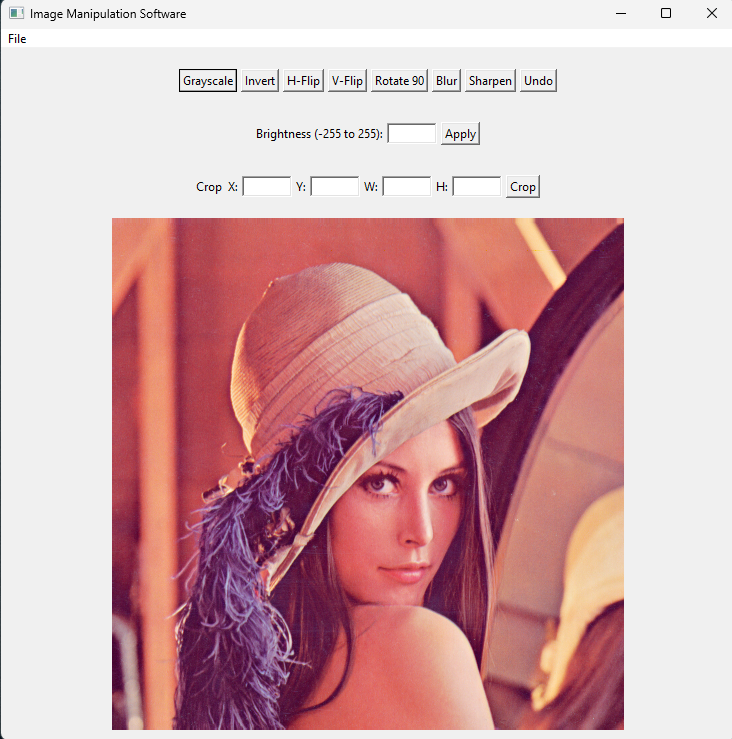

# Image Manipulation Software

A small graphical image editor written in C, using the [IUP](https://www.tecgraf.puc-rio.br/iup/) toolkit for the GUI. Pixel data is read, manipulated, and written back out entirely by hand — no ready-made grayscale/blur/etc. functions from an image library.

Works on **24-bit uncompressed BMP** images only.



## Features

- **Open / Save** — load a BMP, edit it, save the result as a new BMP
- **Grayscale** — weighted RGB → intensity conversion (`0.299R + 0.587G + 0.114B`)
- **Brightness** — add/subtract a value across all channels, clamped to 0–255
- **Invert** — negative-style color inversion
- **Horizontal / Vertical Flip**
- **Rotate 90°** (clockwise)
- **Crop** — extract a rectangular region by X, Y, Width, Height
- **Blur** — 3×3 neighborhood averaging
- **Sharpen** — 3×3 convolution kernel (optional/bonus feature)
- **Undo** — single-level undo, restores the image to before the last operation

## Project structure

```
main.c          entry point — starts IUP and opens the window
gui.h / gui.c   the GUI itself: window, buttons, menus, and callbacks
image.h/.c      everything that touches pixels: BMP load/save, all the
                manipulation algorithms, and single-level undo
Makefile        build script for Linux
iup.dll         IUP runtime library (Windows) — kept next to the .exe
```

## Requirements

- A C compiler (GCC/MinGW)
- The [IUP](https://sourceforge.net/projects/iup/) library and its headers
- **Linux:** GTK3 development headers (`libgtk-3-dev`) and `pkg-config`
- **Windows:** a MinGW build of IUP (e.g. `iup-mingw6`)

## Building

### Linux

```
make
./app
```

### Windows

```
gcc main.c image.c gui.c -I"C:/Program Files/iup-mingw6/include/iup" -L"C:/Program Files/iup-mingw6/lib/dll/iup" -liup -o app
.\app.exe
```

Adjust the `-I`/`-L` paths if IUP is installed somewhere else on your machine. Keep `iup.dll` in the same folder as `app.exe` so Windows can find it at runtime.

## Usage

1. **File → Open** and pick a `.bmp` file.
2. Click any filter button (Grayscale, Invert, Blur, etc.) to apply it.
3. For **Brightness**, type a value between -255 and 255, then click Apply.
4. For **Crop**, fill in X, Y, Width, and Height, then click Crop.
5. **Undo** reverts the most recent operation (one level only).
6. **File → Save As** to write the result out as a new BMP.

## Known limitations

- Undo only remembers one step back, not a full history.
- Only 24-bit uncompressed BMP is supported — no PNG/JPEG/compressed BMP.
